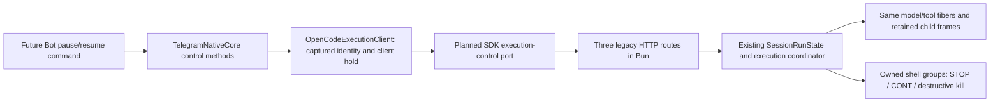

# Production execution control: architectural decision

Execution, pause and resume remain production-supported **B: required by the target
True Pause/Resume Telegram feature**. There are 41 current Bot SDK members and three
additional committed target-architecture members. Current Bot usage is an accurate
consumer inventory, but cannot by itself determine the migration contract.

## Concrete dependency and process boundary

Current Bot `src/core/native-core-service.ts:228` opens `TelegramNativeCore` without
`executionControl`; its pause command aborts and later prompts. Its
`src/opencode/process.ts:104-109` launches a separate `opencode serve` process.
Node hosts the Bot/native package; Bun hosts authoritative model/tool execution.

Production `runtime/src/core.ts:83-95,164-177` constructs `OpenCodeExecutionClient`
and exposes `pauseRun`, `resumeRun`, `inspectExecution`. The client's
`OpenCodeExecutionControlPort` (`runtime/src/opencode/execution-client.ts:12-15`)
requires execution/pause/resume transport operations. It serializes requests,
checks the captured binding/worker/run/temporary target before and after transport,
and holds client work/delivery/budgets while pending or uncertain.

These are downstream Telegram Core additions in the `patches/0004-telegram-session-execution.patch`, not
upstream-parity routes.

The **planned exact consumer** is the Bot migration adapter passed to
`TelegramNativeCore.open({ executionControl: { port, requestTimeoutMs } })`.
It maps those three port operations to generated legacy SDK
`session.execution/pause/resume`, supplying the captured canonical directory,
session and run ID, plus the deadline signal. Prompt/command admission must forward
that same logical ID as `telegramRunId`. No adapter is added to Bot by this PR.

Inside Bun, the three legacy handlers call existing `SessionRunState.execution`,
`pause`, `resume`. That service owns the live execution tree; its change operation
checks the live owner, persists paused intent before acknowledgment, and resumes
only the same continuation. Recovered intent reports `continuation: unavailable`.
The existing execution coordinator retains parent/child frames and gates descendant
model/tool work. `runtime/upstream/telegram-owned-process.ts:39-40` suspends/resumes
owned shell groups with SIGSTOP/SIGCONT; retirement kills even stopped groups.
Shared MCP/LSP workspace services are not indiscriminately suspended with a parent.

## Alternatives and sequencing

Native `RunRegistry` holds only client-side activity. Calling it directly cannot
pause fibers or shell groups in the other process. Database paused intent is
recovery state, not a live control channel. Signaling the entire Bun process would
freeze unrelated Topics, shared services and the HTTP server needed to resume.
Aborting and reprompting loses the continuation and can replay side effects.

A dedicated JSON-line/socket IPC transport could express the same three operations,
but would add framing, lifetime and acknowledgment paths while retaining all the
same runtime authority. No smaller implemented native/internal contract replaces
these routes. The three existing wrappers reuse services already required by
inference/abort; they add no production dependency or process class.

If absent during migration, requests return 404. The native client marks a requested
control operation uncertain and leaves work/delivery held until explicit retirement.
The Bot could not provide True Pause/Resume with that candidate. Core must ship and
verify the capability **before Core stable**, then Bot can adopt the aligned runtime,
SDK and native package in a separately authorized migration. Core stable does not
require prematurely changing today's Bot behavior.

Full upstream v2/control-plane, PTY, UI/TUI, CodeMode, FFF, mDNS and other removed
surfaces remain excluded. Only these three Telegram-owned legacy routes return.
Current-call inventory and target-contract requirements remain separately labeled.
Their measured size/graph delta and cumulative verification are in the PR evidence.

Measured at the same source identity/catalog/build location: restoring the wrappers
adds **998 emitted bytes** and 2,092 source bytes, **zero input modules/packages or
process classes**, and **zero final executable bytes** (113,887,360 bytes in both
profiles, at the compiler’s executable allocation granularity).
